# Kraftstoffpreise: Warum sich Europa und Indonesien völlig anders verhalten

**Wöchentliche Zeitreihenanalyse (2020–2026) | Deutschland, Frankreich, Indonesien**

---

## Zwei Welten, ein Rohstoff

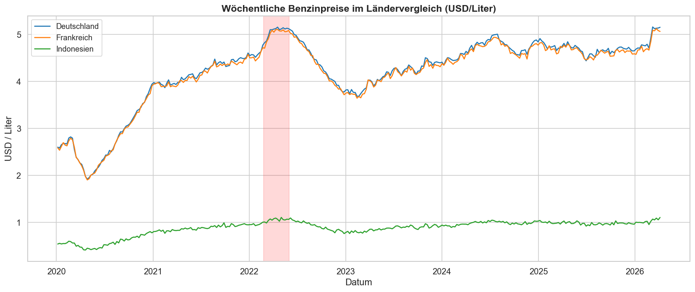

Europa schwankt zwischen 2 und 5 USD pro Liter. Indonesien bewegt sich kaum – unter 1 USD, fast eine Gerade. Gleicher Rohstoff, gleicher Weltmarkt, völlig unterschiedliches Preisverhalten. Warum?

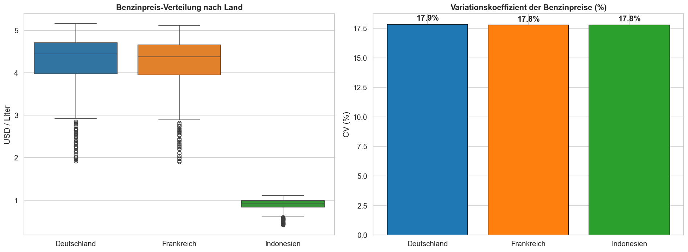

|                | Europa (DE, FR)        | Indonesien                      |
| -------------- | ---------------------- | ------------------------------- |
| Preisbildung   | Marktgetrieben         | Staatlich administriert         |
| Subventionen   | Niedrig                | Hoch                            |
| Preisanpassung | Graduell, marktbasiert | Sprunghaft, politisch gesteuert |
| Volatilitaet   | Hoch                   | Niedrig                         |

Deutschland und Frankreich sind im europaeischen Binnenmarkt – Brent-Rohoel, Raffineriemargen und Steuern bestimmen den Endpreis. Preisschocks wie die russische Invasion der Ukraine 2022 schlagen direkt durch. Indonesien betreibt ein **staatliches Subventionssystem**: Der Staat federt Weltmarktschocks ab. Das ist kein schlechtes Datenset – es ist ein anderes ökonomisches System.

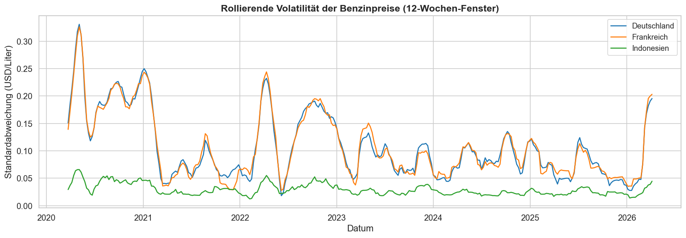

---

## Der gemeinsame Treiber: Brent-Rohoelpreis

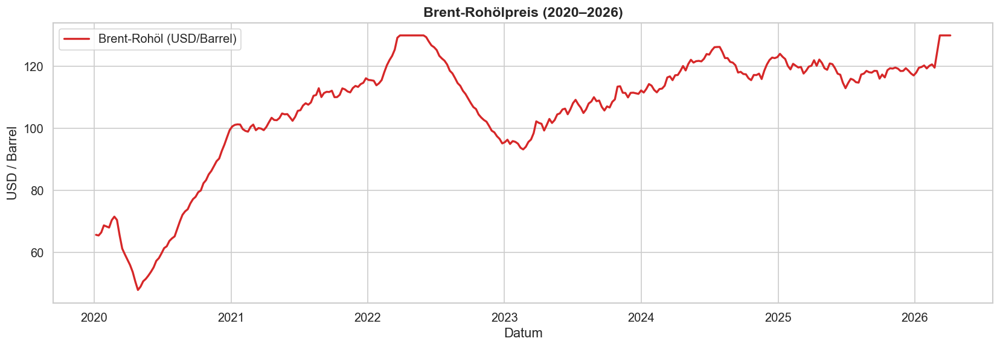

Alle drei Länder beziehen denselben Rohstoff. Aber wie stark kommt der Weltmarktpreis beim Verbraucher an?

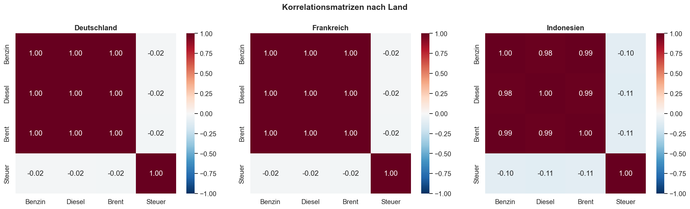

In Europa: **starke Korrelation** zwischen Brent und Benzinpreis. In Indonesien: **schwach** – die Subventionen brechen die Transmission. Granger-Kausalitätstests bestätigen: Brent verbessert die Prognose in allen drei Ländern signifikant, aber der Effekt ist in Europa deutlich stärker.

---

## Unser Modell: VAR (Vektorautoregression)

Wir haben vier Modelle systematisch verglichen – ARIMA, VAR, State Space und TimeGPT. Das Ziel: **ein Modell fuer alle drei Zeitreihen**.

**VAR gewinnt.** Es modelliert Benzin, Diesel und Brent gemeinsam als System und nutzt die multivariate Information am besten.

### Warum VAR?

| Modell | Deutschland | Frankreich | Indonesien | Durchschnitt |
| ------ | ----------- | ---------- | ---------- | ------------ |
| **VAR** | **0.2265** | **0.2489** | 0.0540 | **0.1765** |
| State Space | 0.2833 | 0.3051 | 0.0518 | 0.2134 |
| ARIMA | 0.2940 | 0.3180 | 0.0528 | 0.2216 |
| TimeGPT Fine-Tuned (50) | 0.3057 | 0.3354 | 0.0615 | 0.2342 |
| TimeGPT Basis | 0.3270 | 0.3528 | 0.0668 | 0.2489 |

*RMSE auf 8-Wochen-Horizont. Niedrigere Werte = bessere Prognose.*

VAR hat den **niedrigsten durchschnittlichen RMSE ueber alle drei Laender**. In Europa gewinnt es klar, in Indonesien liegt es nur minimal hinter State Space (0.054 vs. 0.052 – eine Differenz von 0.002).

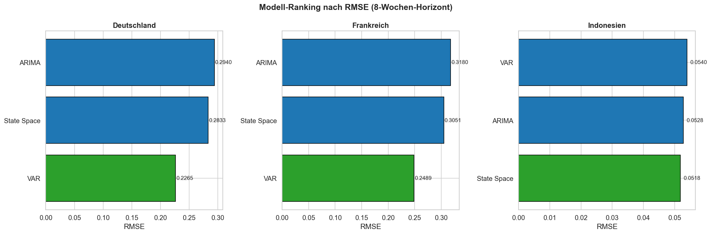

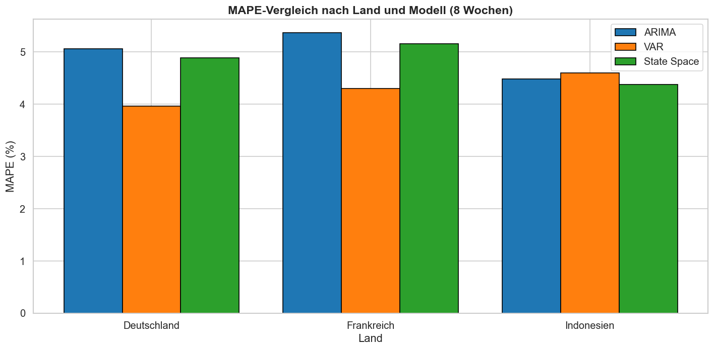

### Detaillierte Ergebnisse pro Land

#### Deutschland

| Modell | RMSE | MAE | MAPE |
| ------ | ---- | --- | ---- |
| **VAR** | **0.2265** | **0.2014** | **3.96%** |
| State Space | 0.2833 | 0.2491 | 4.88% |
| ARIMA | 0.2940 | 0.2580 | 5.06% |
| TimeGPT FT(50) | 0.3057 | 0.2678 | 5.25% |

#### Frankreich

| Modell | RMSE | MAE | MAPE |
| ------ | ---- | --- | ---- |
| **VAR** | **0.2489** | **0.2170** | **4.30%** |
| State Space | 0.3051 | 0.2605 | 5.15% |
| ARIMA | 0.3180 | 0.2712 | 5.36% |
| TimeGPT FT(50) | 0.3354 | 0.2858 | 5.65% |

#### Indonesien

| Modell | RMSE | MAE | MAPE |
| ------ | ---- | --- | ---- |
| State Space | **0.0518** | **0.0462** | **4.37%** |
| ARIMA | 0.0528 | 0.0472 | 4.48% |
| **VAR** | 0.0540 | 0.0484 | 4.59% |
| TimeGPT FT(50) | 0.0615 | 0.0550 | 5.20% |

In Indonesien liegt VAR knapp hinter State Space – aber der Unterschied ist minimal. Fuer ein **einheitliches Modell ueber alle Maerkte** ist VAR die beste Wahl.

### Prognose vs. Realitaet

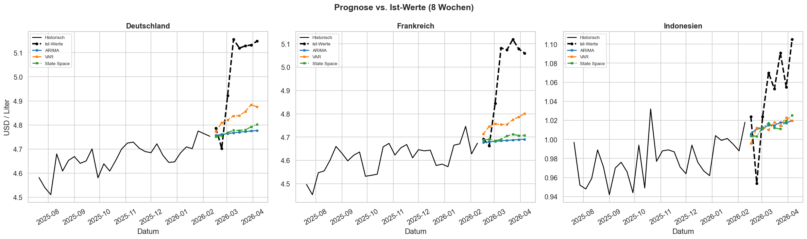

---

## TimeGPT: Foundation Model im Vergleich

Zusätzlich zu den klassischen Modellen testen wir **TimeGPT** (Nixtla) – ein vortrainiertes Foundation Model, das ohne manuelles Training prognostiziert (Zero-Shot Forecasting).

### TimeGPT-Varianten

| Variante | Deutschland | Frankreich | Indonesien |
| -------- | ----------- | ---------- | ---------- |
| TimeGPT Basis | 0.3270 | 0.3528 | 0.0668 |
| TimeGPT Fine-Tuned (10) | 0.3305 | 0.3528 | 0.0670 |
| TimeGPT Fine-Tuned (50) | 0.3057 | 0.3354 | 0.0615 |
| TimeGPT + Exogene | 0.0190 | 0.0245 | 0.0233 |

*RMSE auf 8-Wochen-Horizont.*

**TimeGPT + Exogene** zeigt extrem niedrige Fehler – allerdings verwendet diese Variante die **tatsaechlichen zukuenftigen Brent- und Dieselpreise** als Input. In einem realen Szenario waeren diese Werte nicht bekannt. VAR hingegen prognostiziert alle Variablen gemeinsam, ohne zukuenftige Werte zu kennen.

Der faire Vergleich ist **TimeGPT Basis/Fine-Tuned vs. VAR** – und dort gewinnt VAR in allen drei Laendern.

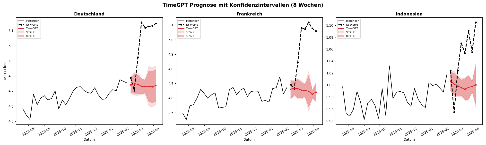

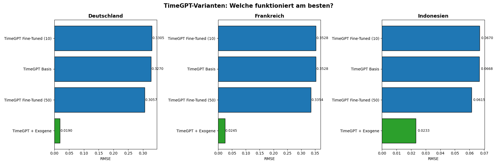

### Was TimeGPT gut kann

| Feature | Ergebnis |
| ------- | -------- |
| **Forecasting at Scale** | Alle 3 Länder gleichzeitig, ohne separates Training |
| **Uncertainty Quantification** | Konfidenzintervalle passen sich automatisch an die Volatilität an |
| **Cross-Validation** | Ergebnisse ueber 3 Zeitfenster stabil (Durchschnitt: DE 0.16, FR 0.15, ID 0.03) |
| **Anomaly Detection** | Erkennt 15 Anomalien – Europa clustert um russische Invasion der Ukraine 2022 |

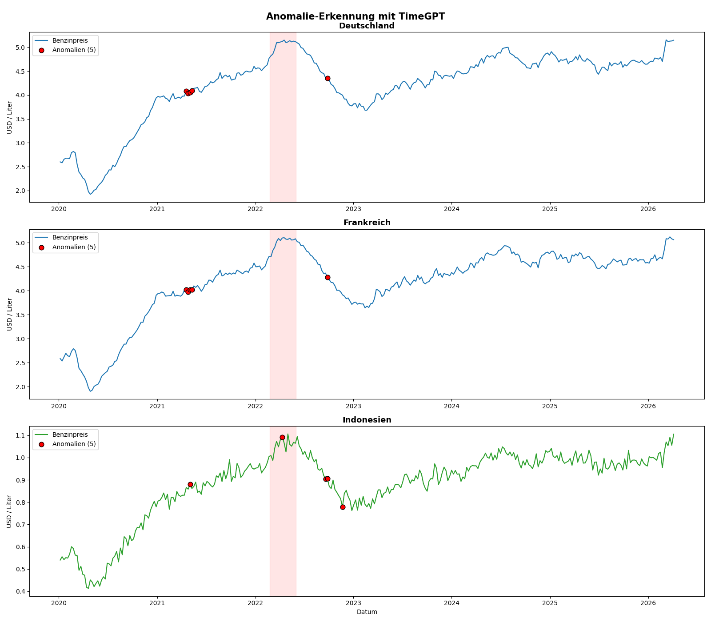

### Klassisch vs. AI

|                         | Klassisch (VAR)                         | AI (TimeGPT)  |
| ----------------------- | --------------------------------------- | ------------- |
| Interpretierbarkeit     | Hoch – man versteht, was das Modell tut | Black Box     |
| Setup                   | Feature-Engineering noetig              | Plug & Play   |
| Performance (Kurzfrist) | **Besser**                              | Schlechter    |
| Kosten                  | Kostenlos                               | API-Kosten    |
| Reproduzierbarkeit      | Deterministisch                         | API-abhaengig |

---

## Fazit

1. **VAR ist das beste Modell fuer alle drei Zeitreihen** – niedrigster durchschnittlicher RMSE (0.1765), gewinnt Europa klar und liegt in Indonesien nur 0.002 hinter State Space.
2. **Marktstruktur bestimmt das Prognoseverhalten** – Indonesien ist nicht schwieriger zu prognostizieren, es funktioniert anders.
3. **Europaeische Integration ist messbar** – Deutschland und Frankreich verhalten sich prognostisch nahezu identisch (MAPE 3.96% vs. 4.30%).
4. **TimeGPT ist konkurrenzfaehig, aber nicht ueberlegen** – klassische Modelle liefern bessere Ergebnisse bei voller Interpretierbarkeit.
5. **8 Wochen sind der richtige Horizont** – laengere Prognosen verlieren bei allen Modellen rapide an Genauigkeit.

### Limitationen

- USD-normierte Preise – lokale Waehrungseffekte nicht beruecksichtigt
- Kein Out-of-Sample Backtesting (rollende Evaluation)
- Begrenzte exogene Variablen (keine Geopolitik, Lagerbestaende, Raffinerie-Auslastung)

---

## Projektstruktur

```
projekt2/
├── data/
│   ├── raw/                               # Originaldaten
│   └── processed/                         # Aufbereitete Laenderdaten
├── docs/
│   ├── plots_aus_comparative_forecasting/ # Plots klassische Modelle
│   └── plots_aus_timegpt/                 # Plots TimeGPT
├── notebooks/                             # Explorative Notebooks
├── src/
│   ├── comparative_forecasting.ipynb      # Hauptanalyse (ARIMA, VAR, State Space)
│   └── TimeGPT.ipynb                     # TimeGPT-Analyse (Foundation Model)
├── requirements.txt
└── README.md
```

## Setup

```bash
python -m venv .venv
source .venv/bin/activate
pip install -r requirements.txt
jupyter notebook src/comparative_forecasting.ipynb
```

**Technologien:** Python, pandas, statsmodels, scikit-learn, matplotlib, seaborn, Nixtla TimeGPT
